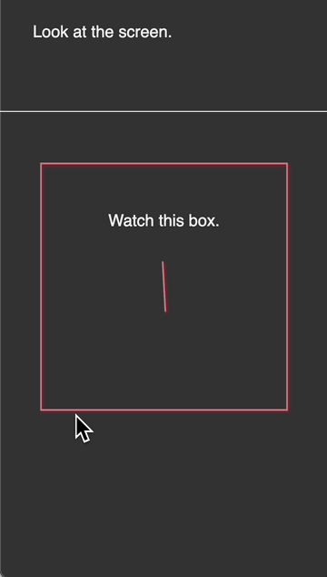
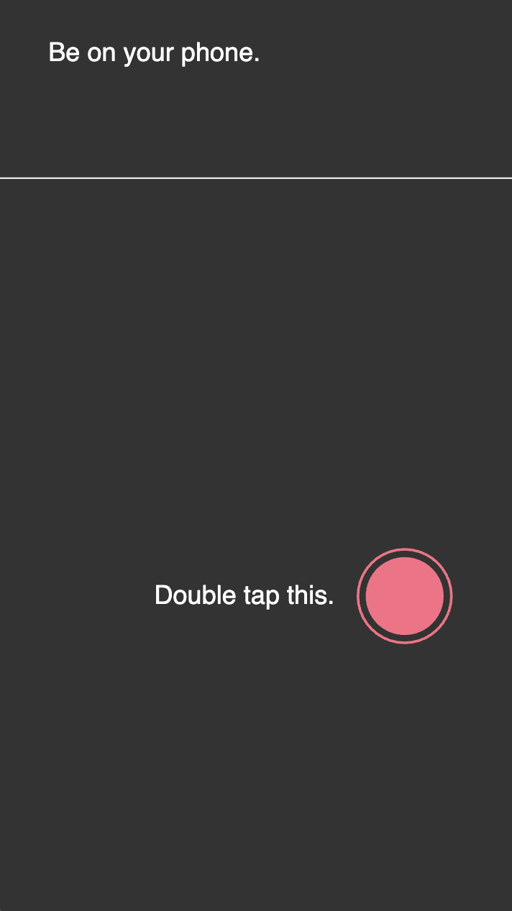

# *It is as if you were on your phone* Press Kit

### [Play Online](https://pippinbarr.com/it-is-as-if-you-were-on-your-phone)

## The basics

* Developer: [Pippin Barr](http://www.pippinbarr.com/)
* Release: 5 March 2025
* Platform: Mobile
* Code repository: https://www.github.com/pippinbarr/it-is-as-if-you-were-on-your-phone/
* Price: $0.00

## Description

*Look at you! On your phone! But you've got a secret! And you won't tell! You're not on your phone! It is only as if you were on your phone! You're just pretending to be on your phone! On your phone!*

*It is as if you were on your phone* is an *almost speculative* game about an *incredibly near future* in which we're all simultaneously under significant pressure to be on our phones all the time, but also to not be on our phones all the time. Our fingers want to touch the screen, our eyes want to watch the surface, our brains want to be occupied efficiently and always. But it's also exhausting liking photos, swiping profiles, watching short-form video, and everything else we're always doing. *It is as if you were on your phone* presents an alternative: *pretend* to be on your phone so that you pass as human, but actually do essentially nothing instead. Follow the prompts and be free.

## History

I've made a bunch of games in the speculative "It is as if" series. One on [Chess](https://pippinbarr.com/it-is-as-if-you-were-playing-chess/info/), one on [Work](https://pippinbarr.com/itisasifyouweredoingwork/info/), one on [Making Love](https://pippinbarr.com/itisasifyouweremakinglove/info/) and one on [Papework](https://pippinbarr.com/it-is-as-if-you-were-doing-paperwork/info/). It seemed fitting to keep expanding outward even further and to explore the idea of making a game about simply seeming to be using a phone at all, with no underlying context or objectives.

I fit this into a "speculative play" framework – games that function in part as experiences from the near future rather than the present – but really we already exist in a world where it could be calming and sane to simply pretend to be on your phone and not worry about the realities of what's on there. So, you're welcome?

## Technology

*It is as if you were on your phone* was created using [p5](https://p5js.org) along with [Hammer.js](https://hammerjs.github.io/) for touch gestures.

*It is as if you were on your phone* is an open source game licensed under a [Creative Commons Attribution-NonCommercial 3.0 Unported License](http://creativecommons.org/licenses/by-nc/3.0/).

## Features

* Tapping!
* Double tapping!
* Typing!
* Swiping!
* Dragging!
* Watching a rectangle!

## GIFs

  
*Tap this*

  
*Double tap this*

  
*Drag this*

  
*Tap these*

  
*Swipe up*

  
*Watch this box*

## PNGs

  
*Title screen*

  
*Info screen*

  
*Tap this*

  
*Double tap this*

  
*Drag this*

  
*Tap these*

  
*Swipe up*

  
*Watch this box*

## Credits

* Pippin Barr: everything.

## Contact

* Email: [pippin.barr+press@gmail.com](mailto:pippin.barr+press@gmail.com)
* Website: [www.pippinbarr.com](http://www.pippinbarr.com/)
* Bluesky: [Pippin Barr](https://bsky.app/profile/pippinbarr.bsky.social)

