# Journal

## Starting point (2025-01-07)

Took some time to think about this by making notes in Things on my phone:

> Points for duration  
> Popping bubbles as typing   
> Precision scrolling  
> Taps and double taps  
> Swiping left and right  
> Don’t fixate too much on it being realistic, just cycling through those ideas  
> Plus emotional instructions  
> Pauses/waits  
> Taps in other places on the screen  
> Game like interactions? Angry birds, fruit ninja, etc? Associated emotions or just random? > I think random right? What is the general affect of a phone user? Take notes. Occasional > smile but mostly dead looking or serious or furrowed?  
> Is there a game over?  
> Are there leaderboards?  
> Can you quit?  
> Keep it fucking simple?  
> Double tap bubble style  
> Some kind of minimalist abstract language of input  

Made a p5 template project which is where we are now. I'll start with that assumption and go from there.

Question: what to do about desktop? Have "it is as if you were on your computer" too which the same stuff but some different interactions? Yes makes sense. But separate projects I suppose. One after the other. Phone first because it's funnier. Computer one is the opposite of Boss Mode which is fun.

## Getting it together (2025-01-07)

While I have a couple of moments let me think some more about the interactions/structure here. I will do a few sketches tomorrow to figure out some of the shape as well.

### Structure

- Intro screen with the title, and then maybe a button for instructions and a button for playing, and maybe a "high score" listed on that front page (assuming the simplest version where people just try to beat their own score rather than a leaderboards thing which sounds like probably the wrong effort/reward? Especially if it's easily hackable and thus kinda pointess)
- Instructions screen that may or may not actually be needed? But could be about how you perform the different interactions like tapping circles, dragging other things, etc. The objectives of the game etc.
- Game screen itself which shows the stuff, has your points building up somewhere and otherwise relatively abstract shapes etc. used to define what you do (see below)
- Game over screen (how would you have a game over though? I guess some kind of timer that triggers at a LACK of interaction and the screen starts going red or whatever as if you're dying, hahaha, and then the game ends after... whatever... five to ten seconds of non-interaction. Love it.) **Meta note here:** classic example of design happening/falling out of some more structured activity like designing screens. In talking about the game over screen you think about what game over is and design it there in that moment.

### Interactions

I probably need to sit with my phone for a bit to truly taxonomize this, and also observe other people, but as a starting point (which if we're being honest is *probably* going to end up being good enough as phones aren't that complex and I'm not really trying to precisely reproduce recognizable apps or anything)

- Bubbles/circles that you tap to dismiss (sound effect?)
    - These can be used to simulate typing (if we cluster them down the bottom and have them kind of repeatedly respawn to allow for a rapid typing motion)
    - These can also be used for any taps we want on the main screen itself as if you're selecting stuff in an app etc.
- Double-bubbles?
    - As in some notation that indicates you should double tap. Just thinking of something like liking an image on Instagram, though it's true that's the *only* double tap I can even immediately think of in that context? Would want some way to indicate it, like a double circle button and you pop the outer and then the inner
- Swipes
    - Most obviously left and right as in a matching app, need to think about look at how this work in terms of whether it's like you're "throwing" or more precisely dragging? Do I need to get into that level of sophistication? Should I distinguish between dragging and swiping at the basic level? Or allow both behaviours to be selected by the player on the same element?
    - One obvious UI element here is the way a slider works, press down to select the handle, drag it to the indicated position, release (much as in It is as if you were playing chess - mentioning that makes me note that there's a failure state there - does the element just reset?)
    - But if it's about a "throw" style of thing maybe a ball with an arrow and you're meant to just physically flick it off the screen rather than drag it? Will this start to get confusion? This is what sketching it for eh
- Scrolls
    - To the extent that doom scrolling is a big thing it obviously gotta be in there, any scrolling, doom or nondoom or predoom
    - I think these can be pretty precise, so they work well with the slider model probably
- Pinches/two finger interactions
    - Pinch in and pinch outs
    - I guess two shapes that you grab and drag into a circle or out of a circle? This one sounds a little informationally dense and might be hard to represent? Unsure about that one...
    
Are those the main ones?

### Sequencing

And then there's the question of sequencing. I don't like the idea of *simulating* a specific app experience, but I think it's true that there are kind of higher level organizatinos that are worth preserving right? Like swipe down then double tap, swipe down then double tap (Instagram where you're liking pictures), or swipe right, scroll down, swipe left, etc... (and note that these could *potentially* be paired with emotion/face notes... but it may be best not to... I can feel this very real tension around whether I'm implying a narrative/real use or not - **note** that this seems key to me and that as of right now my heart/mind lies with the idea of NOT trying to do any simulation)

What are some of the larger organizational units we might think about (more and more this is seeming like I need some sort of small field study - if only of myself - of using apps and seeing what the behaviour is over time?)

- Instagram - scrolling down interspersed with (double? doesn't have to be) tapping, maybe even commenting
- Matching - swiping left/right pairs with scrolling (through a profile? I literally don't know how this software works - do you even scroll up/down in it??? I have asked Femke, but I can also just get one of these apps I guess -- **later** she reports in that you go left/right for no-match/match, up fast for super-like, up slow for scrolling the profile)
- Reading the news/internet more generally? Scrolling, tapping, scrolling more... but a slower kind of scrolling I suppose; could arguably involve back swiping to change to previous page, but that's seeming more simulation-y
- Settings? Where you're kind of tapping through a hierarchical menu... e.g. just a sequence of taps and scrolls... I guess that's basically just the previous one though so maybe that doesn't matter
- Match-3 game: targeted small swipes all over the screen
- Angry Birds: targets small swipes at edge, followed by extensive waiting (too extensive really for the purpose)

### Who are you trying to fool?

In amongst all this, a key question: WHO is meant to be fooled? Not the player, they're meant to *look like they're on their phone* which means mostly just a cursory glance from someone on the metro. But COULD mean they're at home or at a party looking busy which might get more scrutiny. But still, it's not like you ever look at anyone and think you know what they're doing? Maybe matching swipes. Or games.

This is where the sort of metanarrative of the game comes in I guess. Much as in the previous two... the idea that it's a *tool* with a *purpose*. In this case my working theory (which I really like) is that it's a tool both to look like you're on your phone (and so a NORMAL PERSON) but also to NOT be on your phone and thus not subject to the abject terrors and punishments of social media and the news and so on... but then of course to ACTUALLY STILL BE ON YOUR PHONE in terms of shutting out the world, hunching, wasting time... but then maybe arguably to ACTUALLY BE MEDITATING??? Ha ha... haaaa? What if...

### The game-iness

A part of all this is that we have a game layer. You score points for

- Duration
- Successful interactions

And I suppose that's all. And that's plenty. Could be really juicy, could be restrained. Unclear for right now. Kind of funny the juicier it is, but the juicier it is the less I can buy into the meditation story... which I do actually quite enjoy?

### Emotional guide; face notes

There's the component of this that refers back to It is as if you were playing chess, which is guidance on how to compose yourself physically, and most obviously facially (though because I just wrote "physically" I'm realizing that postural changes work pretty well here too). I don't think these need to be connected to the interactions - you can smirk, frown, raise an eyebrow, be dead-faced (the most common note, haha) to anything any content any interaction. But this is an important bit for the "urban camouflage" idea involved in this.

God, this is actually pretty good? I'm talking myself into this pretty hard right now. Ah, young love.

## Early sketching (2025-01-08)

The resolution on this image sucks, but it's still legible I think. Or not? Maybe click to view? Struggling with just how terrible it is...

[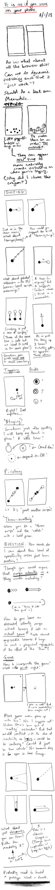](./images/2025-01-08-sketching.png)

Next step is some prototyping, indeed.

## First prototype; Feedback; Suite talking; and beyond  (2025-01-10)

Early days still but did produce a simple prototype of randomized circle-tapping yesterday (which would be the build associated with this journal's commit). I was happier than expected with the visual presentation on my phone, though need to discourage/rule out landscape because it just doesn't work and isn't part of the way you generally think of/see people doing stuff on their phones. But yeah the opening salvo worked pretty well. The commit included a couple of things to think about:

> - Consideration: the amount of time between taps
> - Consideration: The size of the icon, the size of the hitbox(circle)
> - Consideration: OOP versus functional programming as this scales up?
> - Consideration: Juice (or lack therein) around the act of tapping (sound, animation, something else?)

> ([44c547a](https://github.com/pippinbarr/it-is-as-if-you-were-on-your-phone/commit/44c547afb4af6a57eff8ae8847537674d4b96466))

### Feedback

That's all mostly technical stuff but it's true especially I need some kind of philosophical position especially on the feedback element (juice or not juice?). There clearly needs to be feedback but my inclination as of right now is to lean into the kind of "Zen" conceit involved here and to make the sounds simple chimes or other zenny sounds (gongs?). Some way of continuing the emotional tone of calm, sort of trying to catch onto the seeming calm of this kind of phone use, but making it actually calm, but making it still engaging? So prototyping some sound formats makes sense, starting with Zenning. The other more obvious would be like a "pop" and the satisfaction around that, but I think that may lead to a more brainless experience?

Some simple animation for the circles appearing and disappearing makes sense too - maybe a combo fade+size in, and then just a size-out? Will try something today as I want to prototype a bit.

Then there's the expressions thing... how to communicate body posture, emotion, thoughts, faces. Where to put it. I can just copy the chess game but worth revisting. Spoke with Rilla this morning around using emoticons (as in ASCII emoji) as a way to suggest things, but I think I probably still prefer the austerity of texts for this element... there's this balancing act/trick around trying to hit the engagement/dissociation/peace target. Which I like as a core challenge for this one actually. And for the whole potential suite.

### Suite talking?

One of the things that has been rising in my mind through thinking about it, talkng to Femke (about matching apps), and talking to Csongor via the *growing stuff* repo, is this sense of a larger and more specialized *suite* of apps based on this core concept. *It is as if you were on your phone* is the generalized idea, but it's clear that an interesting and worthwile thing to make would be *replacement* apps for all the classics (WhatsApp, Messages, TikTok, Instagram, Facebook, etc.). Each one is a minimalist set of interactions that replicate what it looks like to be on those apps, but subtracts the content. And you could have all of them to create this phone environment that's purely about the (soothing?) motions of social media etc., but is really about calm and inner peace because you get the advantages of the Wall of your phone (nobody should bother you, you're entitled to this space) without the anxieties/pressures of the actual content.

Making this a much bigger project is pretty interesting. I *think* it still makes sense to start with the general case, though, and then perhaps to expand from there. Because I suspect the larger/broken down Suite would have to be a little more professional, maybe even on the App store instead of "just" a website. Though maybe the website works for sheer accessibility as the browser really isn't bad in terms of the screen real estate available and you could make a little fake home screen and so on for it.

Anyway, I think this is the right starting approach for right now.

### And beyond

Rilla asked the question "when are you going to make *It is as if you were being a person*?" and that's genuinely pretty inspiring. I can imagine an album or a podcast (which? podcast is funnier) which has tracks/episodes that are literally vocal instructions for "how to be" in a specific context. Could consult with Jorge and Jadé about language, pacing, etc. Maybe make background music in the PO or something fun, and just put them out there. Like 20 minute tracks (akin to meditations) where you don't have to deal with the pressure of figuring out how to be normal/unobtrusive.

Plays into neurodiversity stuff in pretty obvious ways, but I also think it can play strangely into entry points to meditation, freedom from ourselves. Could also imagine a novel where all these things exist, but let's not go there please. PLEASE.

So that's something else to consider building up some experitise and scripts for, but it's a totally separate project, but might be fun to think about an episode/track for A MAZE. A general purpose track would be really funny too. Just "around the house" would be funny. There's a sort of bizarre "life coaching" angle in it too. It's definitely funny.

## To p5 or not to p5? Thumb radius? The real thing? Zen? (2025-01-13)

### To p5 or not to p5?

The most boring thing first. In running tests it seems like at least in the ways I've been able to investigate, p5 is giving me a pretty massive lag on touch events, enough that it feels bad. I can't seem to find a way to make this not happen - mostly it seems like any touch fires *two* events, and the *second* one is actually the one that takes effect and is delayed enough that it feels laggy. It would be great if I could figure this out as I'm pretty comfortable in p5, but if I can't?

I played around a teeny bit with PixiJS to write this little thing

```js
// Create our application instance
(async () => {
    const app = new PIXI.Application();
    await app.init({
        width: window.innerWidth,
        height: window.innerHeight,
        backgroundColor: 0x2c3e50,
        antialias: true
    })
    document.body.appendChild(app.canvas);

   const gr  = new PIXI.Graphics()
    .circle(200, 200, 30)
    .fill(0xffffff)
    .on("pointerdown", (event) => {
        app.stage.removeChild(gr);
    });

    gr.eventMode = "static";
    
    app.stage.addChild(gr)
   
})();
```

I ran this in their sandbox and learned a few basic Pixi things to get a circle you can tap and it goes away. It goes away instantly. *However*, it's also true that I can get "instant" performance in p5 so long as there's no conditional checking if the circle is clicked... which obviously I need, but... why the fuck would a very minimal if-statement cause a substantial delay in processing exactly?

Well okay while I was writing that and becoming so incredulous that this kind of problem could conceivably exist I dug further into the double-event problem and wrote code to ignore the "mousedown" event that's triggered (LATE) on a touch, listening only to the "touchstart". That turns out to work it seems - I get a responsive feel for the taps (though I need to test directly on my phone).

So for now I suppose I won't abandon p5 just to keep prototyping in a world that I know, but there are probably a bunch of other questions that are going to arrive around potential physics and feel that I dunno if I can solve. Swipes are a huge one (though I can use the swiping library I think to address some of this stuff? Hammer was it? Something else? Swipe.js?). Still really unclear on how to handle specifically the "swipe right" kind of feeling most of all in terms of symbols... could I have literally an arrow that says... swipe right? swipe left? scroll down? scroll up? stop? etc... more directed, less zen? Maybe that's the thing that gets me to a less zen place which I think might have been a distraction? (Though I quite like the zen version of this? As opposed to the "fitting in as a human" version... hmm it's still unclear...)

Maybe you could even incorporate the instruction iself into the text about what you do with your face? "Swipe right and wince"?

### Thumb radius?

Exciting I know but as I was interacting with the early prototype on the metro I found that the circles were spawning too high sometimes for me to reach them with solo thumb, which I think it's a pretty default design issue that you are not supposed to have in all these apps? So I should probably think about a spawn zone that's lowed down to deal with that so that this thing can be successfully one handed.

And thinking of that made me think of

### The real thing?

What if I approve the design of this game in terms of "secretly" switching between modes which reflect the interaction patterns of different apps, e.g. a TikTok mode, a YouTube mode, an Instagram mode, a Messages mode, a reading the news/website mode? That would help sustain more "sensible" patterns. I wouldn't even need to tell the user this is happening up top, and it would then feed more or less directly into work on the App Suite version of this project, for which this thing is in some ways a prototype/general case?

That would allow me to tackle the whole thing mode by mode rather than as a whole mega thing.

So that's the next kind of plan; break it into modes, have the modes switch at random points of time, but don't tell the user so they don't need to worry as much about being "in character" for the mode. This is sort of the "least stressful" version?

### Zen?

I need to think more about the Zen thing. Versus "just" the social camouflage thing.

## Swipe prototyping; visual prototyping; the main thing (2025-01-16)

### Swipe prototyping

I did get a basic swiping thing going with a visual indicator today. Just a little pip that runs along inside a bar based on swipe velocity. It's not much, but it's felt helpful to have something a bit more clearly responsive and it felt like it got a bit at the question of what kind of visual representation to have... which in turn led to doing some visual prototyping because I'm still not really sold on the approach...

### Visual prototyping

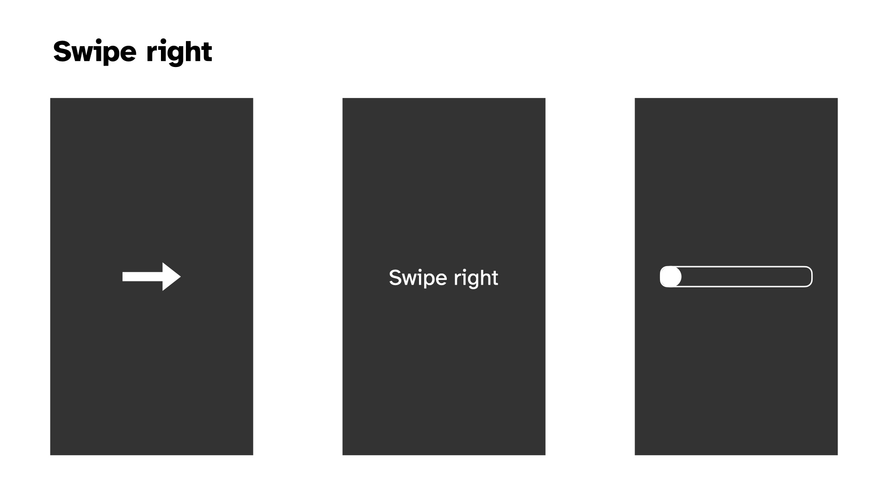

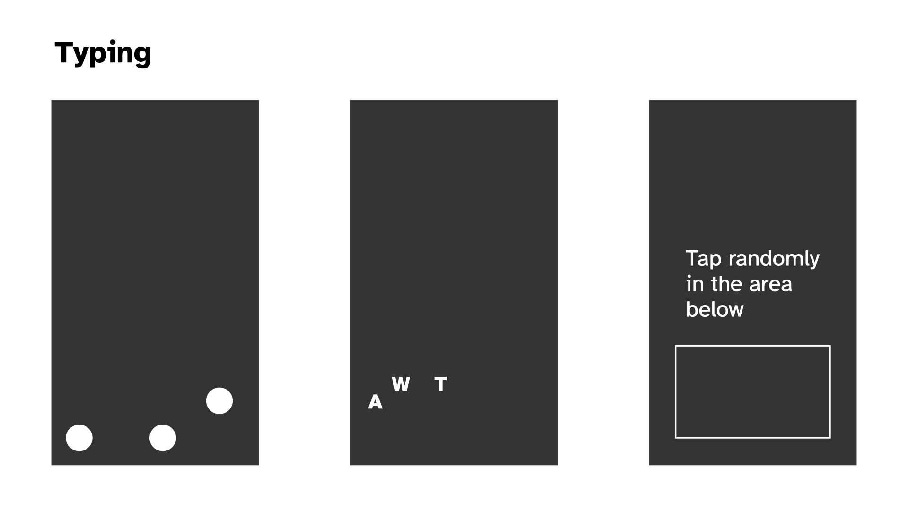

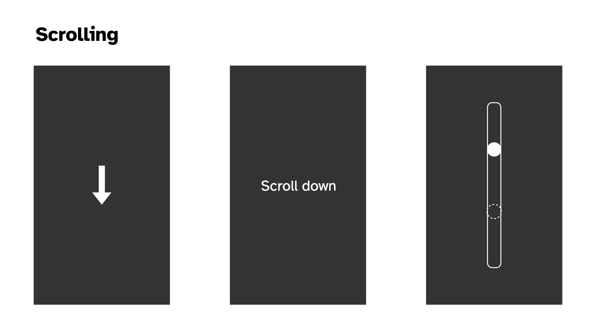

### The main thing

In putting together the above visual prototypes (which I did not labour over, but which were helpful as a way to break free from the code) I kept running up against the classic stupid question: what is this thing about. As with any portion of the project, it's really hard to make serious decisions about *anything* without having the underlying principles in place.

There are a few competing ideas going on here, not all necessarily on the same axes...

- Is this about **social camouflage**? Like the speculative design idea of a near future (present present?) where people just want to *look* like they're nice normal folks using their phones, but they're exhausted by the actual act of absorbing all the information, dealing with their brand, keeping up with the online world
- Is this about a **zen experience** with your phone, leveraging the familiar (soothing?) motions of using a phone, but reframing them to be about abstract ritualistic movements that can be meditative and freeing?
- To what extent is this about **fidelity to specific applications**? As in, should this recognizably feel like "I'm on TikTok" or "I'm browsing Pinterest", or should it be a layer of abstraction away from that, more at the level of "I'm scrolling, I'm swiping, I'm tapping" in various combinations?
- How **precise are the interactions** in the experience? Is it "scrolling" or is it "scrolling to exactly this position"? Is it "typing" or is it "typing this word"?
- How **gamified** is the experience? I've thought in terms of points initially, how does this fit in with the ideas I'm listing out here? What do points say about the experience? Am I still interested in the idea you can *lose* by not interacting often enough? (Would this be something than Zen mode turns off?) Does the gamified part of this (points, losing on time) end up being a "commentary" on social media in a stupid way or a good way?

I've thought about the Social Camouflage thing as primary - helping people fit in while avoiding social media exhaustion- What about **passive experiences of a cellphone**? When people are watching YouTube, they're just watching YouTube; do we have a "Watch this rectangle" activity? I mean, that's very funny, but goes against the idea you can "lose" I had earlier. Or does the timer not expire for watching the rectangle? Watch this progress bar, with no timer for losing.
 - but it seems like Zen can be in there too "just" by adding a Zen Mode to the experience either at the beginning or even as a toggle always at the top of the screen?

In writing this out I think a more *abstract* understanding is better. So no need in this version to think hard about what the interaction sequences (and specific screen locations) are for, say, TikTok.

I'm concerned by the tension between relief/social camouflage and the gamified version where it seems like it would be very stressful. Why would you play this as a *game* specifically? There's some way in which that ends up feeling too close to the real experience? Am I just concerned that without some gamified element people won't see the point in interacting longer term? But if it's an application, then it's not really intended to be played in that way - it's a tool not a game?

This is making me think we kill the game-y elements.

So we'd be landing on something like:

- **Social camouflage** is the main perspective. You can look like you're on your phone without being on your phone, while actually being on your phone.
- There is a **Zen Mode**, where everything just makes gong sounds. Kind of a joke, and kind of not a joke. Could include some "wisdom" in the instructions.
- It is **abstract**, so just a sequence of classic interactions (maybe grouped into things like scrolling and tapping, scrolling and scrolling, swiping and scrolling, but maybe not even that); not intended to mimic specific apps (but there's a whole separate project where we do exactly that)
- It is **not a game** so there are no points, it's just there as an app when you need it.

## Nexts (2025-01-23)

I've done more prototyping at this point such that we've got passably okay version of generally tapping locations, swiping left or right, keyboard input.

The big interactions missing are *double tap* (maybe I seek to solve that today in the abstract) and *scrolling* (which introduces the fear of working with swipes and pans somehow, but maybe it'll be fiiiine)

Once I get *some kind of version* of those two things it would be time to think more structurally about how all this works in terms of a flow through the game, notably changing modes, how I'm going to deal with the question of visual representations, how I'm going to deal with colour (or not), how I'm going to deal with sound, ...

Uh quite a lot of stuff. My main feeling, though, is that the project is on a good trajectory that I can handle. And that it remains a pretty fun feeling idea.

## Refactor? Visuals (2025-01-23)

### Refactor?

As I started trying to "easily" "breezily" implement double taps it felt like the moment that everything would break apart (mostly my mind) in terms of the structures at play. It spiralled me out into thinking (fantasizing??) about OOP and inheritance and a beautiful clean cool implementation of All This. So I stopped what I was doing and turned to visuals as a way to do something a bit less dizzying.

But the point remains. At some stage I either need to move to a "better framework" for this project (plain JS? Pixi? Phaser??) or I need to build some of that better framework myself. Neither option is super appealing in this exact moment, but the stage to do it is probably closer to now than to later.

Ugh. But also, kind of fun once you get into it? I feel like I'm oscillating on it, but *probably* it's "easy" (ahahahahaha) to work with p5 and OOP/inheritance. Plus I've just kind of wanted to build something out entirely in p5 and I guess this could be it?

### Visuals

Anyway I also did some more visual stuff to think about the front end of this thing.

More ideas about scrolling. The main preoccupations here are going to be:

- The question of whether there's a target and whether you can overshoot it with a too-vigorous swipe-scroll
- The question of confusion around the scoll down/up relative to actual swipe motion and how you indicate/don't indicate that thing

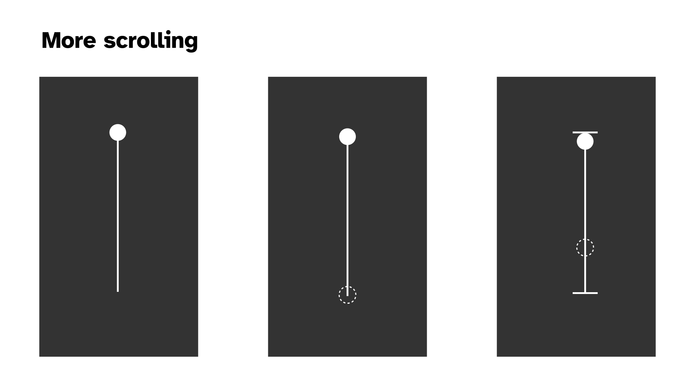

Doublt tapping seem relatively fine. If we're going symbols then I think the double circle makes plenty of sense in terms of a target and a simple indication of whether the double is complete.

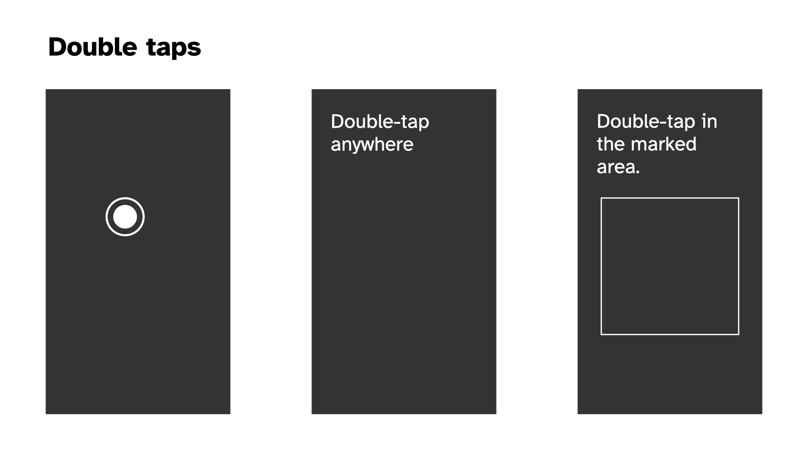

New on the scene, and plausible with the current plan to remove the "game" stuff around scoring and passivity. The idea that one of your tasks is just to look at something for a set amount of time. (Note that this isn't actually incompatible with points now that I think about it, if we explicitly introduce the timer for how long to be passive for.)

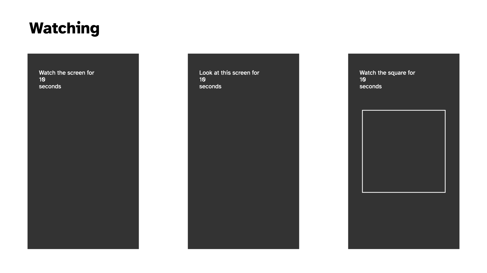

The question of what the instructions should look like. Pretty trivial tbh but I thought I should do it. Probably a black background lends them more credibility. What about a white box outline? Probably too confusing if we have a "watch this square" setup somewhere in there. Putting them at the top, where we're less likely to have interactions (because of thumb radius) seems smart.

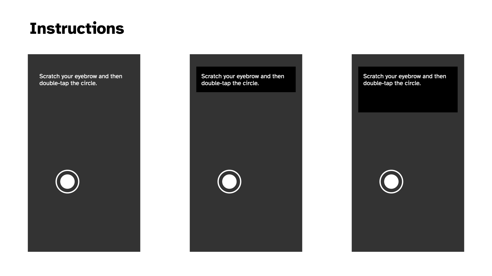

And then two kind of vomit-inducing colour palettes. I don't like either of them but I thought I should at least gesture toward it. The muted greyscale that references/is from the Chess edition makes sense to me. Abstraction, not fun, not unfun, just there. Dark mode/light mode? Perhaps yes.

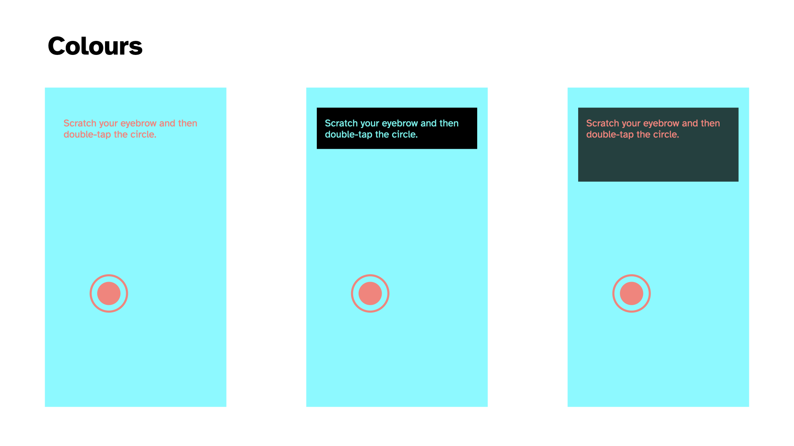

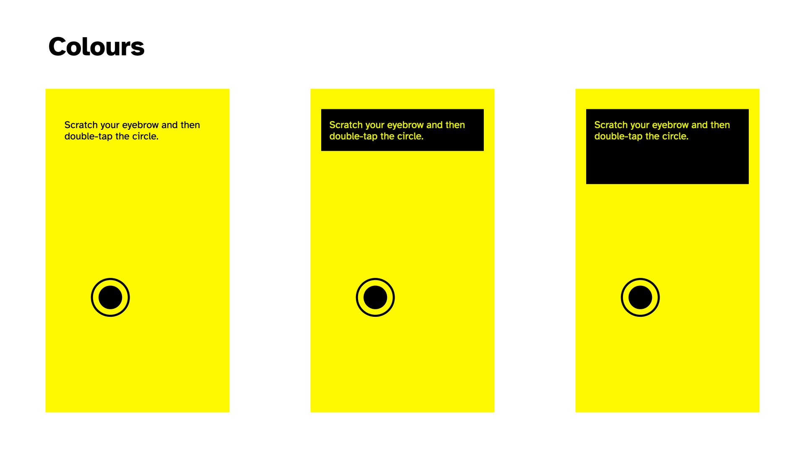

## I OOPed in the code pool; I wanna be an FSM (2025-01-28)

### I OOPed in the code pool

Wow, Pippin. Just wow.

Well I did convert the "code base" to OOP over the last couple of sessions and it was predictably pretty satisfying. 

The unsurprising result is that it makes the project feel kind of manageable in a way it wasn't feeling before when I was kludging away at the functions level. It no longer seems like I'll go further and further insane as I try to add additional ideas into the code because the place to intervene is much clearer and I can rely on inheritance to keep things (relatively) calm.

### I wanna be an FSM

The more surprising result, which I mentioned in commit [4d55b31](https://github.com/pippinbarr/it-is-as-if-you-were-on-your-phone/commit/4d55b31fbd94b2523cf78070797c022b2e00ae90) is that it feels much more like there's an alignment between implementation and the spirit of the project. Some of that is probably ultra ultra inside baseball in the sense that it's just something I care about... the idea that the code reflects the result in some fun way, whether metaphorical or literal or whateveral.

But I think there could be more to it. The code is now broken down mostly into

- States, which are activities like "Web Browsing" or "Messaging", say
- Interactions, which are atomic actions taken like "Tapping in a random location" or "Swiping left"

With the idea that a State is just a particular kind of sequencing (statistical? more calculated than that? a pattern? a grammer? Tracery?) of a specific set of interactions. A finite state machine OR WHATEVER. Amirite? But probably I am right and that is it and I should actually look at FSM implementation ideas.

But the appealing thing here is the connections I think get drawn between (let's say I'm right and it's) FSMs and the human desire to know what to do. It kind of explicitly is an answer to the very human cry "I want to be a Finite State Machine"? Input to output baby.

So I'm saying that in switching programming paradigms I'm finding a better way of thinking about/expressing a part of what this whole thing is *about*, which is the desire we maybe have (sometimes?) to be more like computers doing computer things in computer ways. (And perhaps to some extent a ton of videogames *are exactly that* in a more obfuscated way?). Anyway, I'd like to pursue this further as I go, but here's at least a marker of something found.

## Reimplementing the wheel?; Structures; A pause explodes my brain (2025-01-30)

### Reimplementing the wheel?

Yesterday I spent time making the scrolling interaction more like what I think of when I do it on my phone, which is crucially that I will semi often flick scroll (swipe into a scroll) and then catch the page to stop it (a press). I felt like that scrolling behaviour needed to be in there, so I made the effort to do so. And as part of all that introduced the pan/drag based scrolling as well.

So I've ended up with a kind of complete representation of scrolling at this point. Including different "length" scrollbars (visually the same but different relative scrolling speed - needs work). All of which does for sure have me wondering if I'm just reimplementing stuff that already exists if I just used some framework? 

In a way, too, I think my intuitions here are related to the sense that you could implement a lot of (all of?) the features I have so far by literally having... you guessed it, a scrollable HTML element. That you would... scroll... in the way that things scroll... on mobile... i.e. get all the behaviours for "free".

Why not do that? I don't have an incredible argument, but I feel cautious that approaching this as a sort of "weirdly implemented webpage" might lead to gaps in my ability to control how things look and flow into each other... that it might turn out to be secretly awkward to do well (god knows the way I'm doing it may too of course). I think there's maybe some philosophy involved in this too; like if I had a truly scrolling element then it's somehow against the principle that the player only performs the "act" and doesn't actually get the result. But I don't know if that truly holds up or not, given I have a UI element that shows scrolling and, for all intents and purposes, *is* scrolling? So I dunno. I dunno.

Anyway, for now the point is to use p5 to make a project and I'm happy to use the canvas and have a sort of app-y feel to the whole thing, rather than tangle with HTML which, let's face it, is a nightmare much of the time... positioning and all that.. ughhhhhhhh. Just give me a rectangle baby.

### Structures

Continuing with pretty meta stuff, I did some refactoring that meant that my Browsing state went from controlling stuff to just being a configuration object specifying the touch events (e.g. swipe, tap, pan) and interactions (e.g. scroll, tap) that the state should run through. Which felt really liberating in that moment - the vision of all the specific states/use-cases/activities as configuration of an underlying structure.

But does that have significant implications for how things unfold down the line? Does it design/engineer me into a corner? Or a channel? Or whatever? Does it close off design space at the code level?

There are various things where I'd want flexibility per activity, but as I'm writing this I feel like it's mostly data driven at that point? That *any* activity is just a sequence of interactions fundamentally? So maybe it's fine? I DON'T KNOW.

### A pause explodes my brain

The other very tiny thing I did today was add a pause between interactions. So you finish a scroll. It disappears. There's a beat. Then the next thing shows up - another scroll or a tap depending RNG. That was fundamentally just a needed thing and I implemented the dumbest version (a delay with a small random variance in timing) just to have it there because it felt badly off without it.

But in doing so it felt like it highlighted/invited other elements I now need to address.

#### Acknowledgement

The interaction seemed to want some kind of UI acknowledgement of task completion, I guess in a way that previews and justifies the element disappearing. So maybe the element turns green, or flashes, or whatever smiles at you. Maybe there's a sound. Maybe a check-mark shows up. The specifics of this depend a bit on the personality of the overall project actually. There's a big difference between "turns green" and "Clippy shows up and congratulates you" for instance. So it's a thinker.

#### Does this look right?

And then of course there's the question of *how long* these delays should be. Because those delays are in part about staging out the user's interactions. You don't want them just scrolling non stop every 500 milliseconds because that wouldn't "look right" right? 

(Although I think there's a big question floating around that I haven't tackled which is the question of HOW RIGHT this should look - is someone glancing your way? Are they studying you to make sure you're REALLY ON YOUR PHONE? Or is the metric that the player should feel like they are REALLY ON THEIR PHONE? That they can imagine some kind of task flow where they would be doing what they are doing?)

#### Acts, actions, and interactions

And ALSO in adding the pause I found myself wondering about the place in the flow of all this of the "acting" (the instructions for facial expressions and other stuff, breathing patterns). I wondered in the commit whether there was a case to be made for having those Acts be part of the larger flow, so not on screen at the same time as the interaction but rather as an action of their own.

There are ways that makes a kind of very soothing sense to me... a flow of actual interactions and more emotional/psychological/postural actions. There's a part of me that things that having actions and interactions on screen at the same time would be a kind of cognitive overload risk when I'm trying to keep it as simple and robotic as possible.

The counterargument to that is that there might be a case for performing an interaction WITH a specific affect, and if they're sequential I don't see how that would work. Something like "perform the next interaction with an exasperated face"? Oh... actually I really kind of like that. "React to the previous interaction with disbelief"? Hmmm... that versus "Perform this interaction with an exasperated face" ...

Hmm I'm convincing myself of the serial flow. I will at the very least try it out next time.

## Dating; acting; testing (2025-02-10)

Well I "missed" a week of development there because I was preparing a talk I gave on Thursday at the ARTSLab at the University of New Mexico for the Gale Memorial Lecture Series. Fancy me. I did talk about, or at least mention, this game so there was a teeny tiny sense in which I did stuff. The idea of this game got some good laughs and some interest from one audience member about helping people with addiction to phones etc. which was kind of interesting - I told them about the zen gongs version and how that had made me think about it as a potential meditation aid. But that's ended up feeling more like a "fork" of the overall project. But funny to think about forking it.

### Dating

I've already marvelled about it in the commit messages today, but it was really pleasing to implement a Dating activity with a minimum of confusion and difficulty thanks to the framework I'd set up for the Browsing activity. I was able to just add a set of classes that represented the approapriate swipes and then it kind of just worked without too much difficulty - it was working within say 20 minutes of starting in on it I think.

As of now the Dating activity is "just" swiping left or right or up with different weightings. So it's mostly left (no match, 20 of them in the array), a bit of right (match, 3 in the array) and a tiny bit up (super match, 1 in the array). That is a breakdown of 83%/12.5%/4.5%. Probably too weighted on a superlike.

This has done the usual thing of opening up questions, particularly around:

- representing weightings/probabilities (the current approach of proportional representation in an array feels more and more clunky and I probably need something more tuned to specifying probabilities directly?)
- the question of how specific to the activity I actually want to be: does it *matter* how many lefts/rights/ups there are? I mean, yes it does, but to what extent
- and continuing from that, what about reading someone's profile which is a little sub-action sequence... does that matter? It would matter in the version where I'm "replacing the app" in a later iteration of this project; but does it matter for this first one, or are we just trying roughly to get the rough ideas of the interactions rather than have them seem accurately simulated in terms of sequencing etc.?

### Acting

I added acting back in. It's currently serial, and it's currently that you have some probability of getting an Act versus an Interaction. It works in the sense that it shows up and so on, but I need to start taking a closer look at how it feels, building to...

### Testing

How do I test this thing? Most obviously I just test it on my own for as long as I'm able to identify things that aren't satisfying, but at some point I probably need to show it to someone else.

There's the question of framing too, which may come out of any testing I do.

Let me pick up my phone now and do some "dating"...

...

It felt... pretty great at a base level? I continue to feel like the core project here makes sense. I don't even totally know why, but just being told to take the actions associated with a more specific kind of real world activity and having them be recognized is in itself satisfying.

In doing it there are some questions/notes though...

- The timing between acts and interactions felt completely janky... the acts felt very divorced from the flow of the whole thing, there was for sure an argument/feeling for them to be visible at the same time, maybe as two independent systems, maybe actually connected to one another
- The question of the relevance of the text was more important than I would have predicted... the things I had in there like eyebrow scratches and three nods didn't feel all that well adapted to the activity of swiping for dates...
- But that in turn raises the weird question of just how specific you want to get there... the weird question I suppose of just how tuned to specific use contexts our body language is with our phones, which I did NOT expect
- But to the extent the Acts are meant to support that broader feeling of "being on your phone" successfully there's an odd balance involved in how much you do or don't understand/know "what you're doing" on your phone... 
- Maybe some of it is "just" the specificity of dating as an activity though? it's not a potentially generic as browsing the web or text messaging...
- The strong emotional valence involved almost feels kind of tricky and that bleeds out into questions about the emotions involved in the other things... texting about the death of your dog versus texting about which showing of a movie to go to... different expressions and you wouldn't(?) just immediately shift one one state to the next and back again emotionally?

Hmmm, so there's some kind of challenging stuff in there. 

- Specialist acts for different activities or even drilling down to iterations?
- Pairing acts and interactions?
- Grammars of acts and interactions?

😮‍💨

## What would it take for this game to be done? (2025-02-14)

Not that it's "taking too long" but it might be a good time to consolidate what the different arms of this are that require more work. Obviously it's not ready *now*, but what does it need? In no particular order...

- **Zen Mode** - in or out? I think it's pretty funny so probably in; would need to UI design for that, which means it needs to go somewhere (top menu I suppose?) and it could go there with an info button too I suppose
- **How many activities is enough?** - well that's a good question, Jim. At least a sweep of the most obvious phone activities? So I'd be missing Video Watching most obviously right now? Browsing, photo stuff, video, dating, messaging... seems like enough. So let's say "**add video and see**" (TikTok versus YouTube though?)
- **How often do you switch activities?** - I suppose just often enough for it not to be excruciating? Some of that is about the support the Acts do/don't offer to things. It's clearly not as engaging as Work or Love because it's taking away the sense of progress. How much weight can the Acts carry, how much should they do?
- **Writing Acts, Targeted Acts?** - Right now the list of acts is incredibly short and not even very appropriate; these need to be written; should they be written with Tracery in hand?; should they be more concrete/specific to emotional circumstances?; should they be tuned into specific activities? (As I write this I think "probably")
- **Interaction Sequencing** - Right now interactions have probabilities of showing up but they're not actually sequenced in a way that would build a sense of a well-known interaction (e.g. scrolling Instragram is like: look look doubletap scroll down look scroll down look look look scroll down scroll down look doubletap -- or something); having a kind of "grammar" of interactions sounds pretty cool but also really tiring, but also maybe what I should be doing... at worst could just be selecting from an array of atomic interactions that deal with "one media unit" or something? Regular expressions? How deep does one go into this exactly?
- **Symbols, words, content** - As of right now I've leant toward a kind of symbolic UI idea where a scroll is indicated by an arrow and a scroll bar. One could also imagine a purely language oriented one "tap" "swipe left" etc. (though you would lose some positional specifics?). One could also imagine a kind of simulated low level UI where scrolling actually scrolls stuff. Though then how do you tell someone to scroll in the first place? Scrolling is confusing because of the up/down direction versus movement thing. It's the main thing that makes me annoyed by the symbols I have. But if I imagine an actual "here's instagram" thing I wonder just how legible that is and how to issue instructions and indicate stopping points etc.?
- **That is, abstraction** - A lot of this is circling around levels of abstraction. How abstract *should* this be to get at its core idea? Do I *want* the person to visualize what they "would be doing" or not? *Should* there even be legible activities in this one, or just a gigantic mish-mash or interactions? Should I be separating out the ideas of a generic "on my phone" from the more specific "on TikTok" setup I've also been imagining? Are these ideas kind of colliding here when they shouldn't be?

Pippin lies down on a sofa and holds his head in his hands.

...

As I lie here, I think that it might have been overstepping for *this* project to think so closely into activities. And you know, I was happy about it at the time, but I think I even made a note that this would be useful for later, rather than for this exact project? I think it's more important for the "on your phone" project that it's just... "on your phone"ness rather than looking like you're doing something specific. That there's maybe even a value to it being kind of inscrutibly just "on your phone" and not "oh he's on tiktok, oh he's on instagram". To which end you'd actually just want a totally randomized set of actions you go through, and some kind of pretty generic Acts that you act out at the same time that match up with someone who is just "on their phone"...

I think I buy that? I still want to make the Suit version where it's all a more specific exploration of specific interaction sets, but I don't think I want to confused them right now.

So if I revisit what needs doing it's more like:

- Are there any other interactions needed to "complete the set"?
    - Possibly just the "look at this box" interaction, I think that one is valuable because looking at your screen while inactive is a thing we do.
- Write proper Acts that convey "I'm on my phone", think about what that means
    - Kind of blankness mostly? I can look at people on public transport on the way home today and reflect on what I look like too. Half smiles, silent laughs, blinking, raise eyebrows, pressed lips, subtle stuff...
- Write a much simpler chaining together of different interactions; just any interactions in any order (see what it's like)
- Consider abstracting the swipe/pan a bit more? Pan as just a "drag this to here" and that can also be achieved by a swipe? (Is there a separate swiping motion we would want?)
- Deciding on the place of language for saying "swipe" versus just an image of an arrow, versus a pip that shows it to you?
    - Hmm so there's still just a little visual design hitch here to think through
    
## More visual design (2025-02-14)

Spent a bit of time in response to the issues identified doing some more visual prodding to see where I could get to and I think I like the direction. The tutorial thing is reassuring - can make it disappear, but initially having the language to set the behaviour is helpful I think.

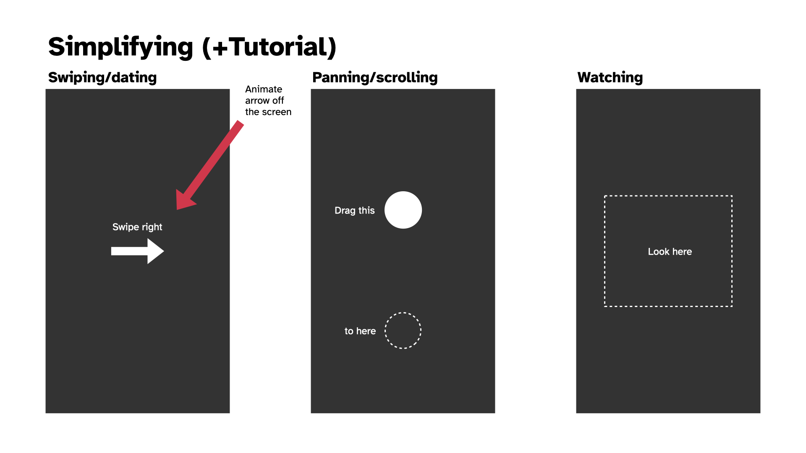

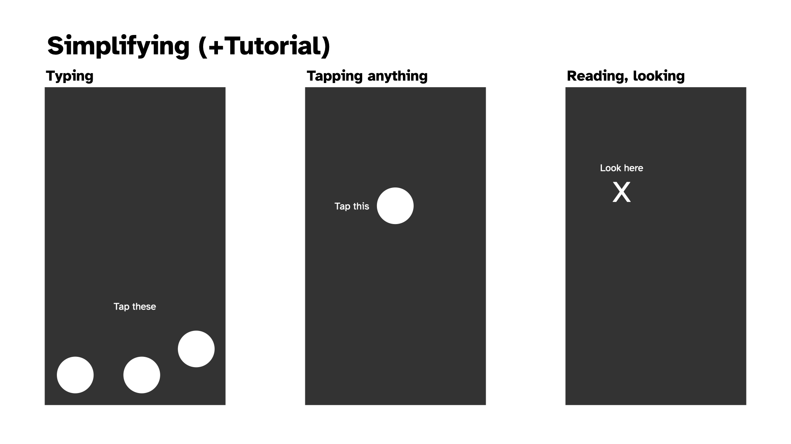

And then there's the idea of how to position any other UI elements, like a Zen Mode toggle and an info button?

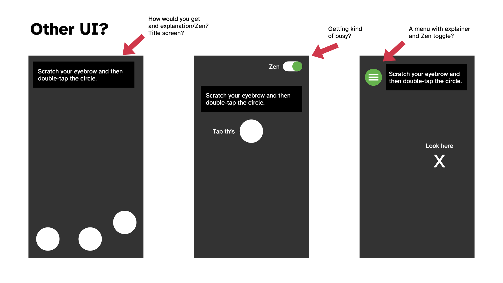

Leading to the idea of just dealing with that on a title page to keep the play screen relative clean?

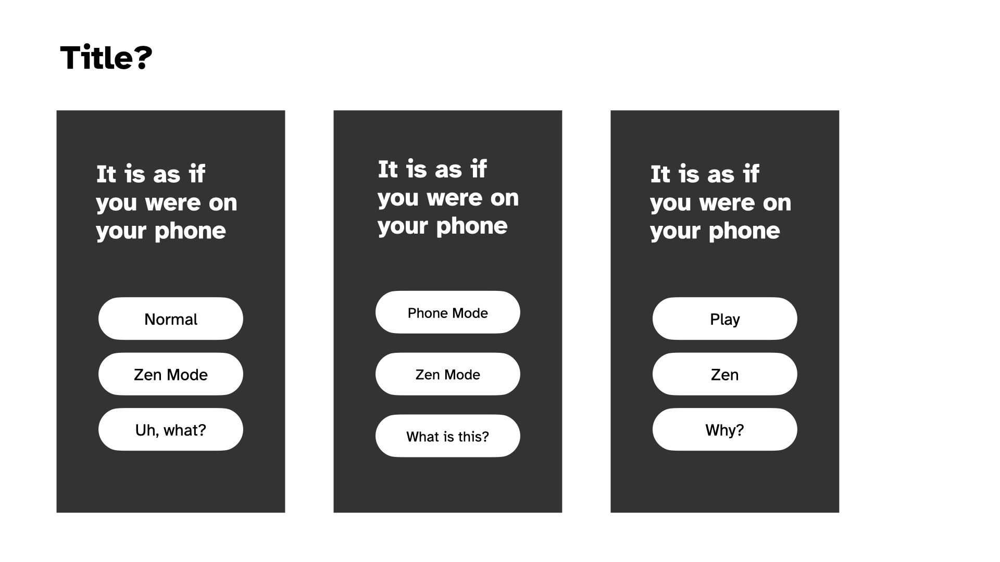

As I do all this, that red arrow in the mockups is making me want a splash of colour in amongst it. Maybe the interaction areas/items could be pink or something?

Anyway, it was pretty soothing to do this because I feel like I'm creeping back to something simpler and less directly connected to actual UI. More abstraction, not less.

## Progress; Zen (2025-02-20)

### Progress

Hwell... I implemented those mockups pretty literally over the last few days and the game has kind of jumped from feeling a bit off to pretty much feeling like what I wanted? It suddenly feels close to done -- though naturally that doesn't mean it *is* close to done.

Crucially I think it seems to work. I've had Jim look at it for the "does it make any sense" angle and he got it. As mentioned in a commit somewhere, I've had Felix play it and got the excellent feedback that he didn't want to stop, helping to emphasize the instinct that there's just a bizarre moreishness to these sorts of basic interactions (which I'm hoping will also play into the Zen mode when I get to it). I also showed it to a couple of other people from the perspective of observing and they confirmed that yes, I looked like I was on my phone, haha.

There are still plenty of things to tidy up around the language, some tweaks to layouts and more. And then there's Zen mode, a menu, and such. But yeah it's reached that point where it feels inevitable that I'll release it as a real thingamie.

### Zen

The next big question for the game is how to create the Zen mode. This is more of a design brainstormy moment but the point is to use the same structure of the game (like, exactly the same) but to have to it communicate and ideally *be* a meditative experience. So:

- **Sound effects** become zen sounds like gongs for taps and... other stuff...
- Should there be **background music**? Dare I make something on the OPZ? Or something generative with chords? Or not really, let people plug in their own music?
- Should the **colours** change? Is there a "zen palette"? And relatedly is there a "better" approach to the palette of the non-zen version? I keep thinking about a sort of rainbow hue shifting thing, but it that just basically pretty dumb? Might look nice? I can try it
- We need an approach to the **act texts** which my first thought was just like a guided breathing thing, then I wondered about a guided meditation sort of set of things around observing/feeling/etc., and another possibility is a single specific quote or whatever that just stays there and you can meditate on the one thing throughout. I don't dislike any of those ideas, but I feel like I should probably just stick to a single one. A quote may be hard to fit? There's good old "If death alone is certain, and the time of death is uncertain, what then should I do?"
- Should there be a **timer** to explicitly pair this with the idea that it's a session of meditation? Or again outsource that? (Could be a recommendation in the explainer text?)

So those are I think the main concerns. None of them are actually all that high challenge, just a thing to do. I guess I try out the different potential textual approaches specifically.

I haven't written a Why for this project. Let me do that.

## High praise; explainers; bye zen (2025-02-26)

Been a few days since journaling - that seems to be the pattern with this one. Often with projects I'll journal every day, but this one I think is probably sufficiently clear in my mind it's less needed. Although I've definitely been wobbling through confusion as well.

### High praise

I mentioned above that the game generally makes sense to people. That continues, which is encouraging. Most notably last night (I think?) Felix and I were FaceTime-ing with Jim and Mary in New Zealand and a message notification came up on my phone (which we were using). Felix instinctively swiped it away and we looked at each other for a beat. Then a couple of moments later he said something along the lines of "do you remember that ball and arrow game? that was fun" - meaning this game, *It is as if you were on your phone*. Clearly this is great because having a six year old remember enjoying playing your abstract game about social camouflage and stripping back interactions into almost-nothingness is... very cool. Also I really liked the way it was linked to him interacting with the phone in a "normal" functional way, and remembering the game through that feeling. This general argument that there's something purely to the *feeling* of *doing something* is also important - it's something I've kind of played down as I've worked on the game because I've become more focused on the idea of camouflage/pretending, but the satisfaction around just *doing a thing* and seeing it work is not to be trifled with.

### Explainers

Part of recent work was creating a menu and and info screen which I dropped some lorem ipsum into. I did that in no small part because when I tried to explain the game in a very small space I really, really struggled. And I think a huge part of *that* was that there's such a signficant difference in intent between the "normal mode" and the "zen mode". It felt very odd and disjunction to be talking about them both on the same screen.

So.......

### Bye Zen

I've passed the game over to David W for comment since he has spent a lot of time using a videogame in a meditative way (Playne). But my growing feeling is that the zen mode just doesn't really work right now. It's too distinct from the main project, it's not about pretending you're on your phone and I think that if I'm going to pursue it as an idea (using phone interactions as a form of meditation) I need to give it its own space to breathe and be its own thing.

This is also going on small bits of feedback where it seems like the zen part of things just isn't all that clear. I can explain it (as to Jonathan at lunch yesterday) and there's a degree of sense (I think particularly in thinking about awareness of phone interactions as a form of focused attention, kind of sensual etc.) but it's kind of awkward, and I don't think it's helping the shape of the bigger thing.

So... bye zen!

## Back problems (2025-02-27)

Wasn't sure how to foreground this sort of "negative design moment" without a journal entry, but I'll be brief because it's not that interesting. Spent some time this afternoon trying to think through how a back button would look on the play screen, because this thing is pretty "appy" and so I figured it made sense as "just good UI design" to have a back button so you could get back to the menu and read the info screen or something. 

However everything looked gross:

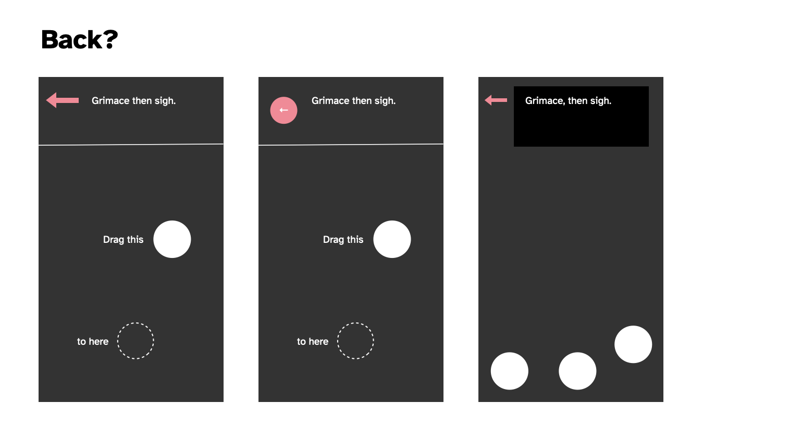

As you can see. There just doesn't seem to be a layout that would fit in a back button. It conflicts everywhere it goes and doesn't contribute to the main goal. And I suppose even philosophically going "back" somewhat defeats the... well no, because you could make a version of this game where you're literally navigating a working larger interface so that's not the thing but it just... doesn't sit right and has nowhere to *be*. Can't be at the bottom because that's for the "keyboard" when it shows up. No room for it up top in conjunction with the acting instructions, and then you've already struck out.

So I don't have a back button, the end.

## Acting math; dead face (2025-02-28)

Hwellll here we are at the end of February. Been working on this thing since... 7 january, so that would be roughly seven weeks? A little more. Considering I've done other stuff in that time I'm pretty alright with the timing - since I do think it's basically done. Not that time matters right? Naaaaaaahh.

### Acting math

Main thing on my mind at this point is about the pacing and especially the scripted acting stuff. As of right now it's a pretty primitive system:

```
{act} {duration}
```

Where duration can secret be another action, so it's a pretty hacky piece of bullshit.

e.g.

```
{Widen your eyes} {for a moment}
```

It occurs to me it could be refined by having a small set of possible structures (not the whole tracery hog but a very small nod to it):

```
{act}
{act} {duration}
{act} then {act}
{act} {duration} then {act}
{act} then {act} {duration}
```

Something like that gives more fleixibility, makes the things more atomic. I particularly don't want it to feel repetitive, even though it will be by definition.

One could imagine breaking it down further in some cases, as with "scratch your knee"... well there's all kinds of things you could scratch, but just how procedural makes any sense for this?

I think I need to take another pass at it with this in mind and see if it helps.

### Dead face

One thing that has occurred to me consistently when using my own phone or observing people in the wild, is that the vast majority of the time we are *not* making faces or moving around or anything, we just look kind of impassive.

So I've wondered about a kind of baseline acting instruction which is just just maintain that deadface, and then to switch that less often to other things. "Look at the screen impassively" over and over again by default. You could vary it, but there's probably a rhetorical point to just returning to the same baseline feeling?

That could then just be in the math... you either get deadface with a fairly high priority, or you ... well maybe you alternate deadface and acting, but the deadface has a longer timing.

I think I should try to implement this and see how it feels.

## Kind of done? (2025-03-03)

It's perhaps a bit sudden but I feel like I'm kind of done with it? I could probably spend all week tweaking certain parts of this, but I'm not too sure that that's really worth it. It feels like it has hit a point where it makes its point, has enough diversity to actually use for a good while, and is solid in terms of not crashing etc.

I should probably revisit the Why stuff and make sure I'm still more or less aligned with the original vision for this (and I should write some kind of closing statement for the same reasons) but yeah I deel basically happy with this one and ready to send it out into the world (on Wednesday I guess? Do I bother to send it to any media? I mean I could... hard to feel like anyone would give any shits?)

I'll make a press kit for now anyway. If nothing else, *I* find them useful.

## The feeling of release; community; success (2025-03-09)

### The release process

Released the game last Wednesday (I feel like that's often the day I go for somehow?) to not a lot of fanfare. I did drag myself through the process of sending it out to my dwindling set of emails I write to for this, posted it to Reddit, etc. Watched it get downvoted to 0 on Reddit, ah yes, that's familiar. Watched it go unnoticed on Hackernews, yep, seen that before...

Somehow Pocket Gamer got hold of it (not sure how that works) and wrote quite an appealing "hmm, this isn't very entertaining but it's weird and interesting" piece where I was listed as a "bonafide underground video game celeb" haha. But also not haha, that's genuinely nice... as a game making guy who has felt increasingly irrelevant (kind of coinciding with making games as a slower pace and the agonizing death of social media as a place to share) it's pretty meaningful to feel like someone knows who I am and what I'm up to in a big picture sense.

I'd sent it to Jason Kottke as part of my short list of people to reach out to and he popped it on his site too which always makes me feel great because I think he reaches a group of people I really see as a key "audience" for this stuff - not necessarily game-folk, but interested in tech-creativity folk.

And then a couple of days later - day before yesterday? Yeah, this timeline is so small - I remembered my idea of being on Bluesky and posted it there in my traditional "hey I made a thing" way. And it was lovely to see a bunch of people check it out and offer bits of feedback (note to self: I'd really like to capture all that stuff because it's such an interesting part of the process - plus such a privilege to get ANY feedback on your work from "the wild").

### It's broken

Anyway, a key point here: some of the feedback was around it being straight up broken for people on Android using Chrome. Which... well I still don't actually understand the reason, but I initially oscillated on caring because it just felt like there's not that much point in engaging deeply with maintenance, even this close to release. But my curiosity got the better of me and I remembered an old bug I kept seeing while building the game - if I ran it in emulation mode in Chrome then the drag interaction would always fail. And this was the error people were seeing, so I thought I could potentially track it down (looking for emulator solutions didn't yield anything I thought would help me out).

So, while at home alone with a decent-sized headcold and a ridiculous sounding voice while Rilla and Felix were at Kalervo's birthday party, I spent a bit of time thinking about the problem. And I decided it was probably hammer.js because that project simply isn't maintained anymore and because the error was pretty clearly coming up on a touch interaction that works in other contexts. So, blame the touch library.

Somehow - very, very against type for me - I decided to just reimplement the entire touch interaction part of the project from the plain javascript events myself instead. There's a happy story here because... it wasn't that hard! Took like an hour? In part because of all the snoozefest engineering stuff I was writing about earlier on - the project is (fairly) well organized and modular (and just simple of course) and I was able to excise hammer quite fast.

Speaking of - one of the insights there I found interesting: in reimplementing swipes specifically I realized that I could afford really basic code because I wasn't trying to *test* the player's ability to swipe a specific direction, so false positives or just too-generous positives were a non issue. Thus the swipe implementation is really, really basic. And it works! It wouldn't be great for a real application, but in this situation a more forgiving version is appropriate because it doesn't break the flow.

Anyway this change made it work well for some people, but I got a couple of comments about it being very laggy. I looked into that just earlier on today(???) wait 40 minutes ago??? Time, man. Anyway, I found somebody talking about lag in p5 on Chrome on Android and saying that pixel density can be an issue because the canvas can be rendered super large when it doesn't really need to be - the solution being to force pixel density to 1. Made that change and then -- community for the win -- was able to ask one of the people to take a look at it to see if it made a difference, and it did!

So yeah there's a nice story there about a good side of social media for me; it gets at this sense of audience where you can kind of be "with" the audience for something and chat to them and have a conversation about it, rather than being an unknown game-producing-entity who is totally removed from the equation. In that way it's related to all the stuff about conversation with materials and the sort of "triangle" of "maker-game-player"... social media creates this thread that's directly maker-player but with "game" as the context. I'm sure this has all been written about properly, but it's a nice thing just to experience.

### But wait, there's more

The above is what I had in mind when I sat down to write this entry - I mostly just wanted to follow up on the release and point out the Bluesky stuff more than anything; that sense of community I really genuinely miss about making games in the context of old Twitter. The sense of a conversation, of having "access" to people who are inclined to be interested in what you're doing, want you to share it with them, want to try it and talk to you about it, or simply to offer words (or likes) of support.

So that was a huge win for me in terms of putting a game out as I feel like lately it's been a bit of a struggle to feel like there's much interest in what I'm doing. (And of course now I do a little search to see if the previous game got any notice and it *did* - hilariously there's a post on slither.io which seems to be a site devoted to Snake games??? And they actually took a serious look at it, incredible.) Anyway I was feeling sad about it all and kind of resigned to just "well, I make things because I want to think about them while I make them" (which is true) and "nobody will really give any shits" (which is not as true, though it can be true because the internet if fickle as fuck).

And *then* while I was fact checking my note above about it being on Hackernews and sinking to the bottom of the ocean I searched for it so I could see if it ever got beyond the 1 point posts get by default and...

I see someone else called bookofjoe also posted it and it made it up to 250 points! That was four hours ago so it's actually sitting up really high on their site (second place after 5 hours is no joke) which is a nice shock... huh. And yeah in analytics there are apparently over 1000 people on my site looking at it at the moment so... cool. Over 4000 "active users" on my site today. The internet is so weird.

Well, that said, I *do* think some of this is "predictable" in the sense that if you work on something that connects with internet/tech/game culture you're more likely to catch the wind of interest from people. But I also think if you try to do that explicitly you most of the time won't get anything out of it because it feels... pretty random to me. But it's true that my "biggest game" (Work) is of that nature too. I can imagine trying to fixate on how to have this kind of success again, but I've never wanted to put in the effort. There are some clear elements that come into play, but intentionally reproducing this level of interest (and let's be clear that by internet standards it remains tiny) is a fool's errand in my opinion.

So, I'm really please the phone game got some traction our there in the wilderness. A bunch of people have now thought along with me about how we use our phones, how it feels to think about using your phone while using it, etc.

Interesting to me, too, that there were numerous comments about the meditative qualities of the game the way it is now, which I think bodes well for a more targeted approach with the eventual meditation suite (I suppose I'm now thinking specifically about it as a meditation suite, which I also really like as I'm writing these words... different apps for different meditative approaches... mmmm, nice.)

Well so yeah. One of those release processes that surprise you by not just being "well... it's out there now, the end".