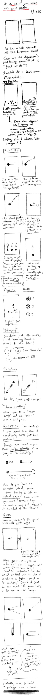

# Journal

## Starting point (2025-01-07)

Took some time to think about this by making notes in Things on my phone:

> Points for duration  
> Popping bubbles as typing   
> Precision scrolling  
> Taps and double taps  
> Swiping left and right  
> Don’t fixate too much on it being realistic, just cycling through those ideas  
> Plus emotional instructions  
> Pauses/waits  
> Taps in other places on the screen  
> Game like interactions? Angry birds, fruit ninja, etc? Associated emotions or just random? > I think random right? What is the general affect of a phone user? Take notes. Occasional > smile but mostly dead looking or serious or furrowed?  
> Is there a game over?  
> Are there leaderboards?  
> Can you quit?  
> Keep it fucking simple?  
> Double tap bubble style  
> Some kind of minimalist abstract language of input  

Made a p5 template project which is where we are now. I'll start with that assumption and go from there.

Question: what to do about desktop? Have "it is as if you were on your computer" too which the same stuff but some different interactions? Yes makes sense. But separate projects I suppose. One after the other. Phone first because it's funnier. Computer one is the opposite of Boss Mode which is fun.

## Getting it together (2025-01-07)

While I have a couple of moments let me think some more about the interactions/structure here. I will do a few sketches tomorrow to figure out some of the shape as well.

### Structure

- Intro screen with the title, and then maybe a button for instructions and a button for playing, and maybe a "high score" listed on that front page (assuming the simplest version where people just try to beat their own score rather than a leaderboards thing which sounds like probably the wrong effort/reward? Especially if it's easily hackable and thus kinda pointess)
- Instructions screen that may or may not actually be needed? But could be about how you perform the different interactions like tapping circles, dragging other things, etc. The objectives of the game etc.
- Game screen itself which shows the stuff, has your points building up somewhere and otherwise relatively abstract shapes etc. used to define what you do (see below)
- Game over screen (how would you have a game over though? I guess some kind of timer that triggers at a LACK of interaction and the screen starts going red or whatever as if you're dying, hahaha, and then the game ends after... whatever... five to ten seconds of non-interaction. Love it.) **Meta note here:** classic example of design happening/falling out of some more structured activity like designing screens. In talking about the game over screen you think about what game over is and design it there in that moment.

### Interactions

I probably need to sit with my phone for a bit to truly taxonomize this, and also observe other people, but as a starting point (which if we're being honest is *probably* going to end up being good enough as phones aren't that complex and I'm not really trying to precisely reproduce recognizable apps or anything)

- Bubbles/circles that you tap to dismiss (sound effect?)
    - These can be used to simulate typing (if we cluster them down the bottom and have them kind of repeatedly respawn to allow for a rapid typing motion)
    - These can also be used for any taps we want on the main screen itself as if you're selecting stuff in an app etc.
- Double-bubbles?
    - As in some notation that indicates you should double tap. Just thinking of something like liking an image on Instagram, though it's true that's the *only* double tap I can even immediately think of in that context? Would want some way to indicate it, like a double circle button and you pop the outer and then the inner
- Swipes
    - Most obviously left and right as in a matching app, need to think about look at how this work in terms of whether it's like you're "throwing" or more precisely dragging? Do I need to get into that level of sophistication? Should I distinguish between dragging and swiping at the basic level? Or allow both behaviours to be selected by the player on the same element?
    - One obvious UI element here is the way a slider works, press down to select the handle, drag it to the indicated position, release (much as in It is as if you were playing chess - mentioning that makes me note that there's a failure state there - does the element just reset?)
    - But if it's about a "throw" style of thing maybe a ball with an arrow and you're meant to just physically flick it off the screen rather than drag it? Will this start to get confusion? This is what sketching it for eh
- Scrolls
    - To the extent that doom scrolling is a big thing it obviously gotta be in there, any scrolling, doom or nondoom or predoom
    - I think these can be pretty precise, so they work well with the slider model probably
- Pinches/two finger interactions
    - Pinch in and pinch outs
    - I guess two shapes that you grab and drag into a circle or out of a circle? This one sounds a little informationally dense and might be hard to represent? Unsure about that one...
    
Are those the main ones?

### Sequencing

And then there's the question of sequencing. I don't like the idea of *simulating* a specific app experience, but I think it's true that there are kind of higher level organizatinos that are worth preserving right? Like swipe down then double tap, swipe down then double tap (Instagram where you're liking pictures), or swipe right, scroll down, swipe left, etc... (and note that these could *potentially* be paired with emotion/face notes... but it may be best not to... I can feel this very real tension around whether I'm implying a narrative/real use or not - **note** that this seems key to me and that as of right now my heart/mind lies with the idea of NOT trying to do any simulation)

What are some of the larger organizational units we might think about (more and more this is seeming like I need some sort of small field study - if only of myself - of using apps and seeing what the behaviour is over time?)

- Instagram - scrolling down interspersed with (double? doesn't have to be) tapping, maybe even commenting
- Matching - swiping left/right pairs with scrolling (through a profile? I literally don't know how this software works - do you even scroll up/down in it??? I have asked Femke, but I can also just get one of these apps I guess -- **later** she reports in that you go left/right for no-match/match, up fast for super-like, up slow for scrolling the profile)
- Reading the news/internet more generally? Scrolling, tapping, scrolling more... but a slower kind of scrolling I suppose; could arguably involve back swiping to change to previous page, but that's seeming more simulation-y
- Settings? Where you're kind of tapping through a hierarchical menu... e.g. just a sequence of taps and scrolls... I guess that's basically just the previous one though so maybe that doesn't matter
- Match-3 game: targeted small swipes all over the screen
- Angry Birds: targets small swipes at edge, followed by extensive waiting (too extensive really for the purpose)

### Who are you trying to fool?

In amongst all this, a key question: WHO is meant to be fooled? Not the player, they're meant to *look like they're on their phone* which means mostly just a cursory glance from someone on the metro. But COULD mean they're at home or at a party looking busy which might get more scrutiny. But still, it's not like you ever look at anyone and think you know what they're doing? Maybe matching swipes. Or games.

This is where the sort of metanarrative of the game comes in I guess. Much as in the previous two... the idea that it's a *tool* with a *purpose*. In this case my working theory (which I really like) is that it's a tool both to look like you're on your phone (and so a NORMAL PERSON) but also to NOT be on your phone and thus not subject to the abject terrors and punishments of social media and the news and so on... but then of course to ACTUALLY STILL BE ON YOUR PHONE in terms of shutting out the world, hunching, wasting time... but then maybe arguably to ACTUALLY BE MEDITATING??? Ha ha... haaaa? What if...

### The game-iness

A part of all this is that we have a game layer. You score points for

- Duration
- Successful interactions

And I suppose that's all. And that's plenty. Could be really juicy, could be restrained. Unclear for right now. Kind of funny the juicier it is, but the juicier it is the less I can buy into the meditation story... which I do actually quite enjoy?

### Emotional guide; face notes

There's the component of this that refers back to It is as if you were playing chess, which is guidance on how to compose yourself physically, and most obviously facially (though because I just wrote "physically" I'm realizing that postural changes work pretty well here too). I don't think these need to be connected to the interactions - you can smirk, frown, raise an eyebrow, be dead-faced (the most common note, haha) to anything any content any interaction. But this is an important bit for the "urban camouflage" idea involved in this.

God, this is actually pretty good? I'm talking myself into this pretty hard right now. Ah, young love.

## Early sketching (2025-01-08)

The resolution on this image sucks, but it's still legible I think. Or not? Maybe click to view? Struggling with just how terrible it is...

[](./images/2025-01-08-sketching.png)

Next step is some prototyping, indeed.

## First prototype; Feedback; Suite talking; and beyond  (2025-01-10)

Early days still but did produce a simple prototype of randomized circle-tapping yesterday (which would be the build associated with this journal's commit). I was happier than expected with the visual presentation on my phone, though need to discourage/rule out landscape because it just doesn't work and isn't part of the way you generally think of/see people doing stuff on their phones. But yeah the opening salvo worked pretty well. The commit included a couple of things to think about:

> - Consideration: the amount of time between taps
> - Consideration: The size of the icon, the size of the hitbox(circle)
> - Consideration: OOP versus functional programming as this scales up?
> - Consideration: Juice (or lack therein) around the act of tapping (sound, animation, something else?)

> ([44c547a](https://github.com/pippinbarr/it-is-as-if-you-were-on-your-phone/commit/44c547afb4af6a57eff8ae8847537674d4b96466))

### Feedback

That's all mostly technical stuff but it's true especially I need some kind of philosophical position especially on the feedback element (juice or not juice?). There clearly needs to be feedback but my inclination as of right now is to lean into the kind of "Zen" conceit involved here and to make the sounds simple chimes or other zenny sounds (gongs?). Some way of continuing the emotional tone of calm, sort of trying to catch onto the seeming calm of this kind of phone use, but making it actually calm, but making it still engaging? So prototyping some sound formats makes sense, starting with Zenning. The other more obvious would be like a "pop" and the satisfaction around that, but I think that may lead to a more brainless experience?

Some simple animation for the circles appearing and disappearing makes sense too - maybe a combo fade+size in, and then just a size-out? Will try something today as I want to prototype a bit.

Then there's the expressions thing... how to communicate body posture, emotion, thoughts, faces. Where to put it. I can just copy the chess game but worth revisting. Spoke with Rilla this morning around using emoticons (as in ASCII emoji) as a way to suggest things, but I think I probably still prefer the austerity of texts for this element... there's this balancing act/trick around trying to hit the engagement/dissociation/peace target. Which I like as a core challenge for this one actually. And for the whole potential suite.

### Suite talking?

One of the things that has been rising in my mind through thinking about it, talkng to Femke (about matching apps), and talking to Csongor via the *growing stuff* repo, is this sense of a larger and more specialized *suite* of apps based on this core concept. *It is as if you were on your phone* is the generalized idea, but it's clear that an interesting and worthwile thing to make would be *replacement* apps for all the classics (WhatsApp, Messages, TikTok, Instagram, Facebook, etc.). Each one is a minimalist set of interactions that replicate what it looks like to be on those apps, but subtracts the content. And you could have all of them to create this phone environment that's purely about the (soothing?) motions of social media etc., but is really about calm and inner peace because you get the advantages of the Wall of your phone (nobody should bother you, you're entitled to this space) without the anxieties/pressures of the actual content.

Making this a much bigger project is pretty interesting. I *think* it still makes sense to start with the general case, though, and then perhaps to expand from there. Because I suspect the larger/broken down Suite would have to be a little more professional, maybe even on the App store instead of "just" a website. Though maybe the website works for sheer accessibility as the browser really isn't bad in terms of the screen real estate available and you could make a little fake home screen and so on for it.

Anyway, I think this is the right starting approach for right now.

### And beyond

Rilla asked the question "when are you going to make *It is as if you were being a person*?" and that's genuinely pretty inspiring. I can imagine an album or a podcast (which? podcast is funnier) which has tracks/episodes that are literally vocal instructions for "how to be" in a specific context. Could consult with Jorge and Jadé about language, pacing, etc. Maybe make background music in the PO or something fun, and just put them out there. Like 20 minute tracks (akin to meditations) where you don't have to deal with the pressure of figuring out how to be normal/unobtrusive.

Plays into neurodiversity stuff in pretty obvious ways, but I also think it can play strangely into entry points to meditation, freedom from ourselves. Could also imagine a novel where all these things exist, but let's not go there please. PLEASE.

So that's something else to consider building up some experitise and scripts for, but it's a totally separate project, but might be fun to think about an episode/track for A MAZE. A general purpose track would be really funny too. Just "around the house" would be funny. There's a sort of bizarre "life coaching" angle in it too. It's definitely funny.

## To p5 or not to p5? Thumb radius? The real thing? Zen? (2025-01-13)

### To p5 or not to p5?

The most boring thing first. In running tests it seems like at least in the ways I've been able to investigate, p5 is giving me a pretty massive lag on touch events, enough that it feels bad. I can't seem to find a way to make this not happen - mostly it seems like any touch fires *two* events, and the *second* one is actually the one that takes effect and is delayed enough that it feels laggy. It would be great if I could figure this out as I'm pretty comfortable in p5, but if I can't?

I played around a teeny bit with PixiJS to write this little thing

```js
// Create our application instance
(async () => {
    const app = new PIXI.Application();
    await app.init({
        width: window.innerWidth,
        height: window.innerHeight,
        backgroundColor: 0x2c3e50,
        antialias: true
    })
    document.body.appendChild(app.canvas);

   const gr  = new PIXI.Graphics()
    .circle(200, 200, 30)
    .fill(0xffffff)
    .on("pointerdown", (event) => {
        app.stage.removeChild(gr);
    });

    gr.eventMode = "static";
    
    app.stage.addChild(gr)
   
})();
```

I ran this in their sandbox and learned a few basic Pixi things to get a circle you can tap and it goes away. It goes away instantly. *However*, it's also true that I can get "instant" performance in p5 so long as there's no conditional checking if the circle is clicked... which obviously I need, but... why the fuck would a very minimal if-statement cause a substantial delay in processing exactly?

Well okay while I was writing that and becoming so incredulous that this kind of problem could conceivably exist I dug further into the double-event problem and wrote code to ignore the "mousedown" event that's triggered (LATE) on a touch, listening only to the "touchstart". That turns out to work it seems - I get a responsive feel for the taps (though I need to test directly on my phone).

So for now I suppose I won't abandon p5 just to keep prototyping in a world that I know, but there are probably a bunch of other questions that are going to arrive around potential physics and feel that I dunno if I can solve. Swipes are a huge one (though I can use the swiping library I think to address some of this stuff? Hammer was it? Something else? Swipe.js?). Still really unclear on how to handle specifically the "swipe right" kind of feeling most of all in terms of symbols... could I have literally an arrow that says... swipe right? swipe left? scroll down? scroll up? stop? etc... more directed, less zen? Maybe that's the thing that gets me to a less zen place which I think might have been a distraction? (Though I quite like the zen version of this? As opposed to the "fitting in as a human" version... hmm it's still unclear...)

Maybe you could even incorporate the instruction iself into the text about what you do with your face? "Swipe right and wince"?

### Thumb radius?

Exciting I know but as I was interacting with the early prototype on the metro I found that the circles were spawning too high sometimes for me to reach them with solo thumb, which I think it's a pretty default design issue that you are not supposed to have in all these apps? So I should probably think about a spawn zone that's lowed down to deal with that so that this thing can be successfully one handed.

And thinking of that made me think of

### The real thing?

What if I approve the design of this game in terms of "secretly" switching between modes which reflect the interaction patterns of different apps, e.g. a TikTok mode, a YouTube mode, an Instagram mode, a Messages mode, a reading the news/website mode? That would help sustain more "sensible" patterns. I wouldn't even need to tell the user this is happening up top, and it would then feed more or less directly into work on the App Suite version of this project, for which this thing is in some ways a prototype/general case?

That would allow me to tackle the whole thing mode by mode rather than as a whole mega thing.

So that's the next kind of plan; break it into modes, have the modes switch at random points of time, but don't tell the user so they don't need to worry as much about being "in character" for the mode. This is sort of the "least stressful" version?

### Zen?

I need to think more about the Zen thing. Versus "just" the social camouflage thing.

## Swipe prototyping; visual prototyping; the main thing (2025-01-16)

### Swipe prototyping

I did get a basic swiping thing going with a visual indicator today. Just a little pip that runs along inside a bar based on swipe velocity. It's not much, but it's felt helpful to have something a bit more clearly responsive and it felt like it got a bit at the question of what kind of visual representation to have... which in turn led to doing some visual prototyping because I'm still not really sold on the approach...

### Visual prototyping


### The main thing

In putting together the above visual prototypes (which I did not labour over, but which were helpful as a way to break free from the code) I kept running up against the classic stupid question: what is this thing about. As with any portion of the project, it's really hard to make serious decisions about *anything* without having the underlying principles in place.

There are a few competing ideas going on here, not all necessarily on the same axes...

- Is this about **social camouflage**? Like the speculative design idea of a near future (present present?) where people just want to *look* like they're nice normal folks using their phones, but they're exhausted by the actual act of absorbing all the information, dealing with their brand, keeping up with the online world
- Is this about a **zen experience** with your phone, leveraging the familiar (soothing?) motions of using a phone, but reframing them to be about abstract ritualistic movements that can be meditative and freeing?
- To what extent is this about **fidelity to specific applications**? As in, should this recognizably feel like "I'm on TikTok" or "I'm browsing Pinterest", or should it be a layer of abstraction away from that, more at the level of "I'm scrolling, I'm swiping, I'm tapping" in various combinations?
- How **precise are the interactions** in the experience? Is it "scrolling" or is it "scrolling to exactly this position"? Is it "typing" or is it "typing this word"?
- How **gamified** is the experience? I've thought in terms of points initially, how does this fit in with the ideas I'm listing out here? What do points say about the experience? Am I still interested in the idea you can *lose* by not interacting often enough? (Would this be something than Zen mode turns off?) Does the gamified part of this (points, losing on time) end up being a "commentary" on social media in a stupid way or a good way?

I've thought about the Social Camouflage thing as primary - helping people fit in while avoiding social media exhaustion- What about **passive experiences of a cellphone**? When people are watching YouTube, they're just watching YouTube; do we have a "Watch this rectangle" activity? I mean, that's very funny, but goes against the idea you can "lose" I had earlier. Or does the timer not expire for watching the rectangle? Watch this progress bar, with no timer for losing.
 - but it seems like Zen can be in there too "just" by adding a Zen Mode to the experience either at the beginning or even as a toggle always at the top of the screen?

In writing this out I think a more *abstract* understanding is better. So no need in this version to think hard about what the interaction sequences (and specific screen locations) are for, say, TikTok.

I'm concerned by the tension between relief/social camouflage and the gamified version where it seems like it would be very stressful. Why would you play this as a *game* specifically? There's some way in which that ends up feeling too close to the real experience? Am I just concerned that without some gamified element people won't see the point in interacting longer term? But if it's an application, then it's not really intended to be played in that way - it's a tool not a game?

This is making me think we kill the game-y elements.

So we'd be landing on something like:

- **Social camouflage** is the main perspective. You can look like you're on your phone without being on your phone, while actually being on your phone.
- There is a **Zen Mode**, where everything just makes gong sounds. Kind of a joke, and kind of not a joke. Could include some "wisdom" in the instructions.
- It is **abstract**, so just a sequence of classic interactions (maybe grouped into things like scrolling and tapping, scrolling and scrolling, swiping and scrolling, but maybe not even that); not intended to mimic specific apps (but there's a whole separate project where we do exactly that)
- It is **not a game** so there are no points, it's just there as an app when you need it.